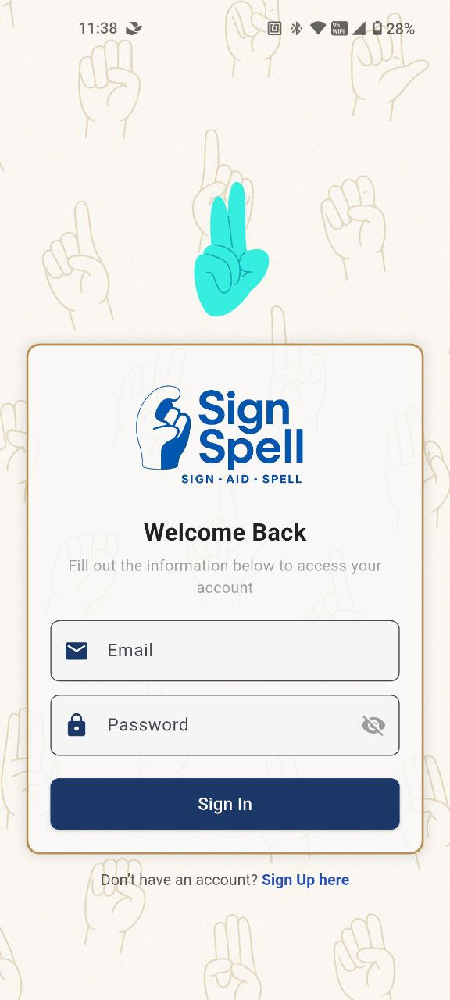
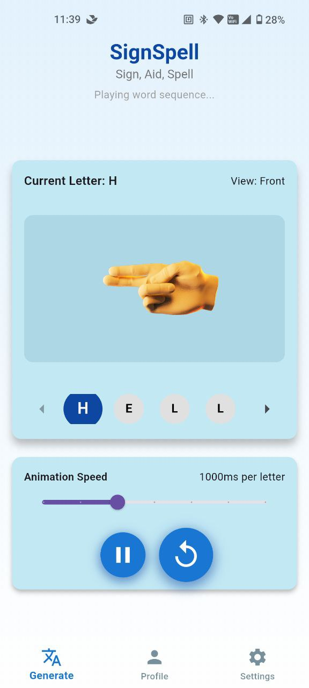

# 📖 SignSpell: Sign, Aid, Spell

SignSpell is a dynamic and intuitive mobile application designed to bridge communication gaps by providing an accessible and engaging platform for learning and practicing **finger-spelling** and basic **sign language**. It transforms text input into clear, step-by-step 3D hand animations and provides full sign language video demonstrations for common words.

## ✨ Key Features

### User Functionality (SignSpell App)
* **Text-to-Sign Conversion:** Enter any word to instantly see its **finger-spelling representation** via a clear **3D hand animation sequence**.
* **Animation Control:** Easily **adjust the speed** of the finger-spelling animation to match your learning pace. Controls allow you to **pause, replay, or navigate** through individual letters.
* **Sign Language Videos:** View **real-life video demonstrations** for common, pre-categorized full sign words (e.g., "hello," "thank you").
* **Categorized Learning:** Explore signs grouped into easy-to-learn categories such as **Greetings**, **Family**, and **Numbers**.
* **Progress Tracking:** The user profile shows your **Recent Words** spelled and statistics on **Total Words Spelled**.
* **Profile Management:** Users can easily **edit their name and email** and access application information (About, Credits, Terms).

### Administrator Functionality (Sign Admin)
* **App Overview Statistics:** The admin dashboard provides crucial metrics like **Total Users**, **Total Words Spelled**, **Total Letters Available**, and **Total Categorized Words**.
* **User Management:** Admins can view a list of all users, search by name or email, and **update user details**.
* **Content Management:**
    * **Manage Letters:** Review and preview the 3D animation for each individual finger-spelling letter (A-Z).
    * **Manage Words:** Review, edit, and categorize existing words, including viewing their associated full sign video previews.

---

## 📸 Screenshots

See the SignSpell application in action!

| User Login & Sign In | Text-to-Sign Feature | Admin Dashboard |
| :---: | :---: | :---: |
|  |  |  |
| **Profile & Activity Tracking** | **Admin User Management** | 
|  |  | 
---

## 🛠️ Technology Stack

| Component | Technology | Notes |
| :--- | :--- | :--- |
| **Development Framework** | **Flutter & Dart** | Used for building the cross-platform mobile application. |
| **3D Assets** | **Custom 3D Hand Models** | Used for precise finger-spelling visualization. |
| **Backend/Database** | **MySQL** | Handles user authentication, content storage, and activity tracking. |
| **UI/UX Design** | Google Fonts (**Poppins**), Material Icons | Used for a modern and accessible interface. |

---

## 🚀 Getting Started

### Prerequisites
To run this project locally, you need:
* **Flutter SDK** (Specify the minimum required version)
* An **IDE** (e.g., VS Code or Android Studio) with the Flutter plugin installed.
* A physical device or emulator/simulator for testing.

### Installation

1.  **Clone the repository:**
    ```bash
    git clone [Your Repository URL Here]
    ```
2.  **Navigate to the project directory:**
    ```bash
    cd [Your Project Folder Name]
    ```
3.  **Install dependencies:**
    ```bash
    flutter pub get
    ```
4.  **Run the application:**
    ```bash
    flutter run
    ```

### Admin Access
To access the Admin Login page for demonstration:
1.  On the main Login screen, tap the SignSpell logo 7 times and "Secret Admin Code" field will appear.
2.  Enter the code: `admin123`
3.  Tap "Go to Admin Login."

---

## 👥 Contributors

* **Ikhwan Syafiq Mohamad Shaipudin** (Development & UI/UX Design)
* **Danial Syakir** (3D Hand Animation & Assets)

---

The new section is ready! You will need to upload your actual image files to your repository and replace the bracketed placeholders `` with the correct markdown linking to those image files (e.g., ``).

Would you like me to help you format the image links once you have the file paths?
